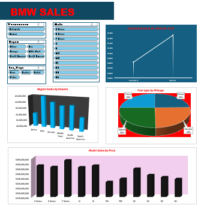
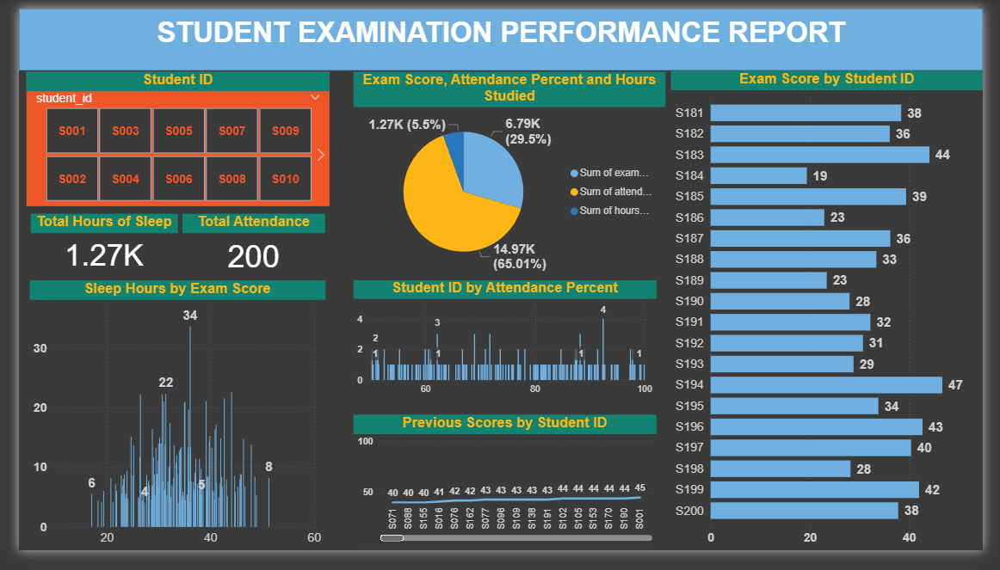

# Project 1

**Title:** [BMW SALES RECORD]( https://github.com/Olalekan3/Olalekan3.github.oi/blob/main/BMW%20SALES%20RECORD.xlsx)

**Tools Used:** MICROSOFT EXCEL( Pivot Tables, Charts, Slicers and Conditional Formatting)

**Project Description:** This project is an interactive dashboard designed to monitor and analyze the sales performance of BMW vehicles across various dimensions. Its purpose is to provide Stakeholders such as sales managers and marketing analyst with a quick, visual overview of key sales trends, regional contributions, fuel-type popularity, and model performance based on price. The dashboard is filtered Region, and Car Type for dynamic analysis.

**Key findings:** Based on a visual interpretation of the charts:

**Continenetal Contribution:* The Europe and Asia regions are the top two contributors to overall sales volume, significantly outpacing the Middle East, North America, and Africa.

**Fuel Type Distribution:* Sales volume appears to be nearly equally distributed among all four fuel types: Petrol, Diesel, Electric, and Hybrid, with each accounting for approximately 25% of the total mix.

**Models Drive Price Volume:* The 3 Series, 5 Series, and 7 Series appear to be the highest contributors in terms of Sales by Price (total revenue/value), suggesting they are the company's highest revenue generators.

**Fluctuation in Value:* The Line chart at the top right expresses a major upward spike in manual transmission by engine size, indicating a highly successful period.

**Dashboard Overview**

# Project 2

**Title:** [COFFEE SALES RECORD](https://github.com/Olalekan3/Olalekan3.github.oi/blob/main/COFFEE%20SALES%20RECORD.xlsx)

**Tools Used:** MICROSOFT EXCEL( Pivot Tables, Charts, Timelines, Slicers and Conditional Formatting)  

**Project Description:** This project is an interactive analytical dashboard designed to track, measure, and visualize coffee sales performance across various coffee companies, including product name, time of day, day of the week, and monthly trends. The purpose is to help management understand when, what type, and at what time of day sales peaks occur, enabling them to optimize staffing, inventory, and marketing efforts.

**Key findings:** Based on a visual interpretation of the charts:

*Top-Selling Products:* The Latte and Cappuccino are the highest-selling coffee names in terms of volume, significantly outpacing other options like Espresso and Americano.

*Sales Peak in the Afternoon:* The Sales by Time of the Day pie chart indicates that the Afternoon (12 PM - 5 PM) is the busiest sales period, accounting for the largest share of daily sales.

*Weekend Sales:* The Sales by Weekdays line chart clearly shows a strong upward sales trend leading into the weekend, with Saturday and Sunday being the highest sales days.

*Hourly Performance:* The Sales by Hours of The Day chart shows that while afternoon is strongest overall, sales are often concentrated in specific hourly blocks.

*Seasonal/Monthly Trends:* The Sales by Month and Weekday Sort chart indicates that sales volume appears to be strongest in the later months of the year e.g September through December

**Dashboard Overview**

# Project 3

**Title:** LOAN APPROVAL REPORT

**Tools Used:** Business Intelligence (BI) Software (Power BI, Slicers and Scorecards) 

**Project Description:** This project is a Credit and Income Analysis for Loan Approval designed to visualize the key financial and creditworthiness metrics of individuals applying for loans. Its primary goal is to assess and display the relationship between Credit Score, Total Income, and Loan Amounts across various applicants. The report helps analysts or loan officers quickly identify trends, high-value applicants, and the distribution of applicants based on credit rating and years of employment.

**Key findings:** Based on a visual interpretation of the charts:

*High Total Income:* The system currently reports a high aggregate Total Income of $181 Million across all reviewed applicants, suggesting a large applicant pool or high-net-worth individuals.

*Credit Score Consistency:* The majority of applicants shown on the red bar chart appear to have high credit scores, predominantly in the 800+ range (e.g., 850, 849, 848), indicating a pool of generally creditworthy candidates.

*Credit Score Concentration:* The central pie chart Total Credit Score by Name and City, shows that applicants are heavily concentrated in three main credit score bands 833, 850, and 846 which together account for almost 100% of the visualized data.

*Employment Diversity:* The sunburst chart Years Employed by Name indicates a highly diverse range of employment tenure, with segments ranging from 1 year to 20 years, with no single employment length dominating the applicant pool.

**Dashboard Overview**

# Project 4

**Title:** STUDENT EXAMINATION PERFORMANCE REPORT

**Tools Used:** Business Intelligence (BI) Software (Power BI, Slicers and Scorecards)

**Project Description:** This project is an analytical report designed to explore and visualize the factors that influence student examination performance. Its main goal is to draw correlations between study habits i.e Hours Studied, biological factors i.e Hours of Sleep and engagement i.e Attendance Percent with the resulting Examination Score. The dashboard allows educators or researchers to filter by individual students and analyze the group's performance trends.

**Key findings:** Based on a visual interpretation of the charts:

*Sleep is the Dominant Factor:* The central pie chart indicates that Total Hours of Sleep 14.97K and 65.01% is the most significant factor by volume among the three visualized inputs Exam Score, Attendance and Hours Studied suggesting a high overall emphasis or volume of sleep data being tracked.

*Attendance is High:* The Total Attendance card shows a value of 200 likely an aggregate score, implying a high level of student presence and engagement in the tracked group.

*Low Correlation between Sleep and Score:* The Sleep Hours by Exam Score chart shows a very wide distribution of exam scores across different hours of sleep, with no clear, strong positive or negative trend. High scores e.g 34 occurred at high sleep hours, but average scores e.g 22, 10, 8 and 4 occur across various sleep levels, suggesting that sleep alone may not be the primary determinant of exam success.

*High-Achieving Students:* Several students e.g. S194, S196 and S184 have achieved very high scores 47, 43 and 44 repectively as shown in the Exam Score by Student ID bar chart.

*Variability in Previous Performance:* The Previous Scores by Student ID shows that the scores hover mainly in the low-to-mid 40s e.g 40, 42, 43, 44 and 45 indicating a relatively consistent previous performance level across the students visualized.

**Dashboard Overview**

# Project 5

**Title:** FOOTBALL PLAYER DATA

**SQL Code:** [HR Database-SQL Codes](https://github.com/Olalekan3/Olalekan3.github.oi/blob/main/Football.SQL)

**SQL Skills Used:** Use of functions like AVG, MAX, MIN, and COUNT.

Use of GROUP BY, WHERE, and HAVING clauses.

Used for comparative analysis e.g comparing a player's weight to the position average

Used for complex ranking and team-wise percentage calculations i.e OVER PARTITION BY

Use of functions like SUBSTRING_INDEX to extract the last name for group analysis.

**Project Description:** This project involves the analysis of a football player dataset accessed from the [dbo].['Football Players Data$'] table. The primary goal is to leverage Structured Query Language to perform in-depth data exploration and reporting on player attributes.

*Objectives:*

*Basic Data Filtration and Retrieval:* To practice fundamental SELECT and WHERE clauses to isolate players based on simple criteria like Team and Position ('WR'), College ('Washington'), Age (<= 25), Experience ('R'), and Weight (> 250 )

*Attribute Conversion and Calculation:* To perform calculations, such as converting player height from separate feet and inches columns into a single inch value, for accurate comparisons and aggregations.

*Aggregate and Group Analysis:* To calculate summary statistics like average height per position (AVG and GROUP BY) and count the number of players grouped by Team and Experience Level.

*Advanced Window Functions and Ranking:* To utilize advanced SQL concepts like Window Functions DENSE_RANK and PARTITION BY to rank players by age within their respective teams, and to calculate the percentage of players in each position per team.

*Comparative Analysis:* To identify players whose attributes e.g height and weight are greater than the average of their peer group e.g players in their team and their position using JOIN clauses and subqueries.

*Identification of Extremes:* To find players with the maximum weight and minimum height for each position, as well as the tallest and shortest players from each college.

**Technology used:** SQL server

# Project 6

**Title:** EMPLOYEE DATA

**SQL Code:** [HR Database-SQL Code](https://github.com/Olalekan3/Olalekan3.github.oi/blob/main/Employee.SQL)

**SQL Skills Used:** CREATE DATABASE, CREATE TABLE

INSERT INTO for populating initial data

SELECT, FROM, WHERE, Comparison Operators (=, !=, <>), OR, AND, BETWEEN

COUNT, MAX, MIN and AVG

UNION for combining results from potentially multiple tables

LIKE operator with wildcard characters (%, _)

Arithmetic Operations (+) for calculating Total Salary

DISTINCT for identifying unique project names

**Project Description:** This project is a basic relational database setup and analysis focusing on core Employee Information.
The main objective is to demonstrate the ability to create a simple database schema, populate it with data, and execute a series of fundamental SQL queries to extract business-critical information for reporting and operational needs.

*Analytical Goals:*

*Organizational Structure Analysis:* Identify employees working under a specific Manager ID in  question 1, 6 and 7.

*Resource Allocation:* Determine the count of employees dedicated to a specific Project P1 and identify employees working on other projects question 3 and 8.

*Compensation and Financial Analysis:* Calculate the maximum, minimum, and average salary question 4, find employees whose salary falls within a specific range question 5 and compute the total compensation Salary + Variable for each employee question 9.

*Data Segmentation and Filtering:* Filter records based on multiple criteria simultaneously, such as location and reporting structure MANAGER_ID using AND and OR logic question 6 and 7.

*Data Uniqueness and Set Combination:* Identify the unique set of projects question 2 and combine employee IDs from potentially different tables using the UNION operator question 11.

**Technology used:** SQL server

